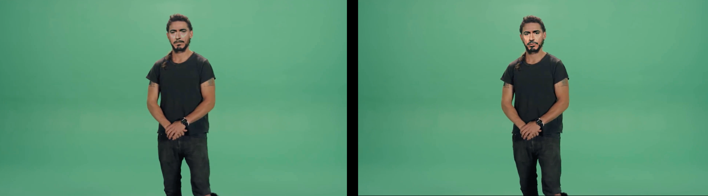

# Project Description

This project is focused on the implementation of a "Deep Fake" deep neural network; it will be a model composed of two smaller deep neural networks, the discriminator network, whose function, once trained, is to accept an image as input, and classify it as either a real image or one that was synthesized using the second component network, the autoencoder (generator) network.

The function of the autoencoder is to learn features of a particular individual's face, or some other aspect of them, and reduce that into a smaller version, called a latent space. This latent space serves as the defining characteristics of the person being trained on. When a new input is given, it will apply that latent information to the new image input, in effect swapping faces and features of the images.

These two networks work in an adversarial way, meaning that they seek to out perform each other. The discriminator tries to accurately guess if an input image is the ground truth or not while the generator network tries to "trick" the discriminator. Together, this is called a Generative Adversarial Network.

In order to accomplish this task, I will first construct the most basic functioning versions of these two network components in order to get an initial baseline of performance. After a functioning prototype is built, each component will be tuned for performance. This will be done by modifying various aspects of the network structures, such as the number of neurons in each layer, the number of layers, and their activation functions. The two components will be developed individually and combined once functional.

As a comparative benchmark, I have generated some sample output from a publicly available DeepFake software called DeepFaceLab. Here are two results I have achieved from it so far. I would consider the result on the left to be under trained, and the result on the right to be better, but over trained on the input data set.

# References

DeepFaceLab: https://github.com/iperov/DeepFaceLab
FaceSwap: https://github.com/deepfakes/faceswap

Autoencoders: http://ufldl.stanford.edu/tutorial/unsupervised/Autoencoders/
https://developers.google.com/machine-learning/gan/generator

Discriminators: https://developers.google.com/machine-learning/gan/discriminator
https://developers.google.com/machine-learning/gan/discriminator

GANs: https://developers.google.com/machine-learning/gan/gan\_structure
